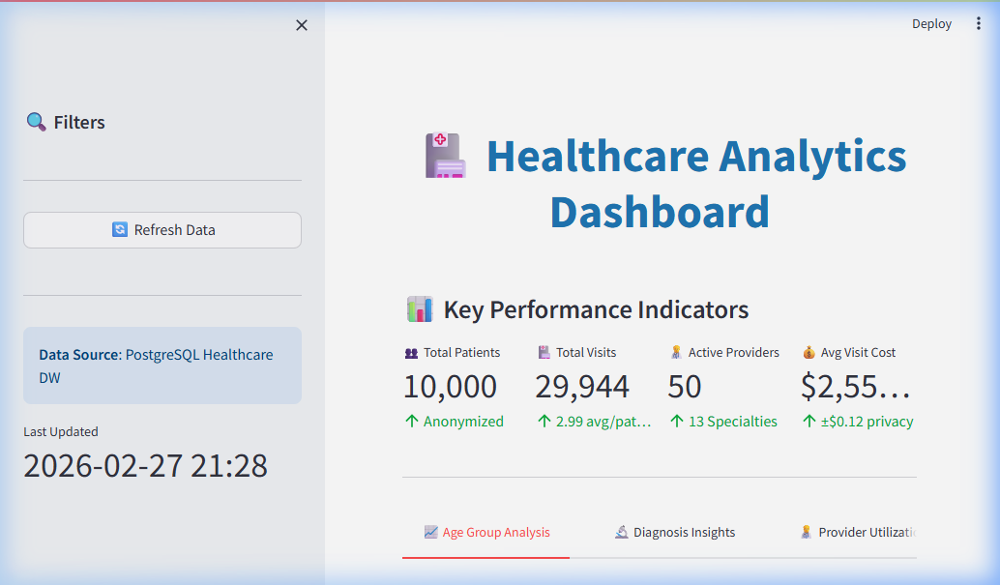
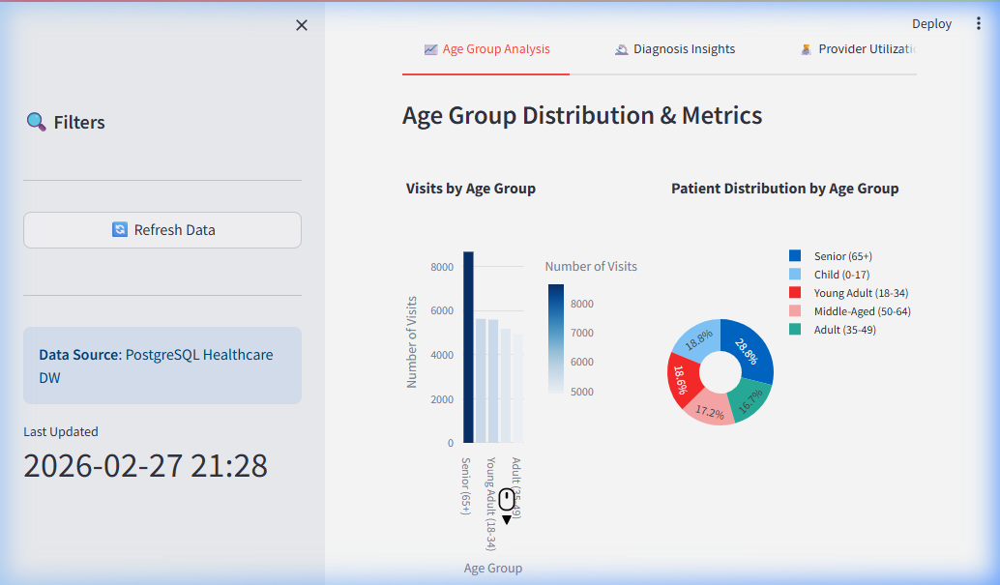
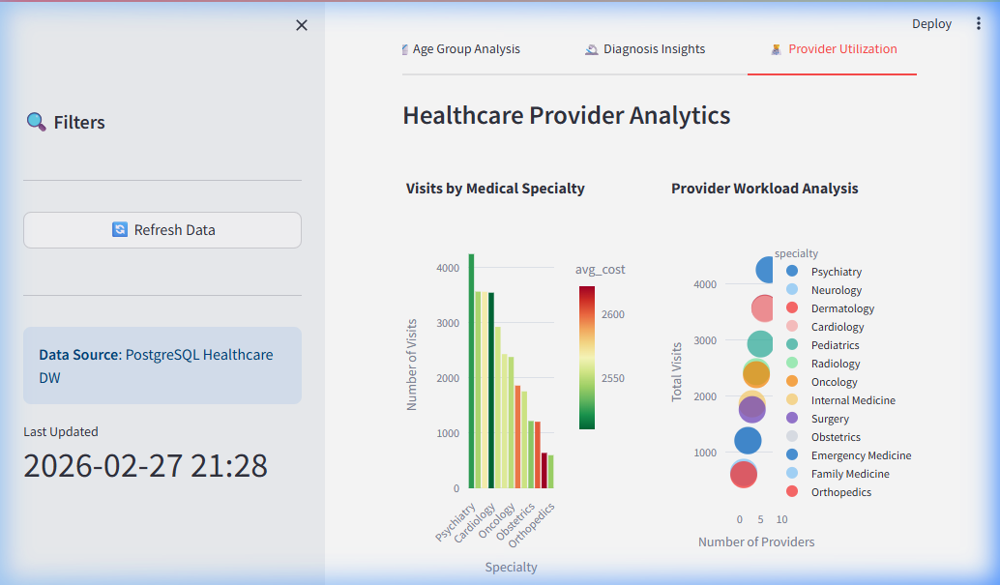
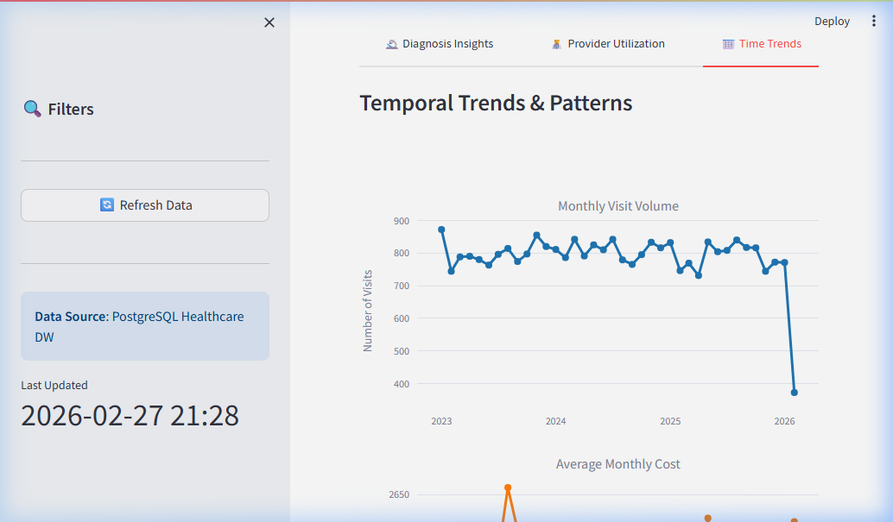
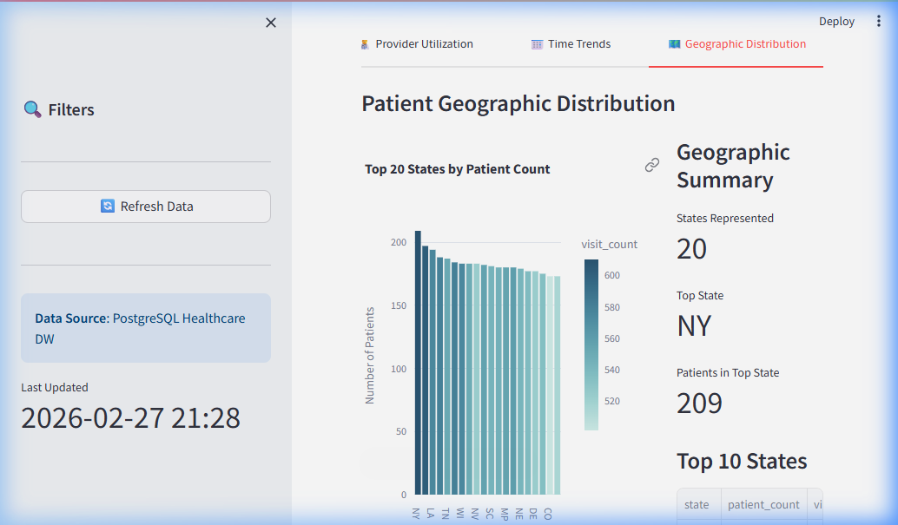

# Healthcare Data Warehouse

A production-ready healthcare data warehouse implementation featuring PostgreSQL, dbt, Docker, and Python with emphasis on HIPAA-like compliance, data privacy through anonymization, and differential privacy.

**🎨 NEW: [Interactive Analytics Dashboard](README_DASHBOARD.md)** - Streamlit-based dashboard with real-time KPIs, visualizations, and insights!

## 🏥 Overview

This project implements a healthcare data warehouse following best practices for:
- **Data Privacy**: SHA-256 anonymization of PII, age grouping, differential privacy
- **HIPAA-like Compliance**: Audit logging, access tracking, data quality validation
- **Scalability**: Table partitioning, indexing strategies
- **Data Quality**: Comprehensive ETL validation and testing

---

## 📸 Dashboard Screenshots

| Main Dashboard | Age Group Analysis |
|---|---|
|  |  |

| Diagnosis Insights | Provider Utilization |
|---|---|
|  |  |

| Time Trends | Geographic Distribution |
|---|---|
|  |  |

---


### Key Features

✅ **Star Schema Design** - Fact and dimension tables optimized for analytics  
✅ **Data Anonymization** - SHA-256 hashing, age groups instead of DOB  
✅ **Differential Privacy** - Laplacian noise addition to sensitive metrics  
✅ **Audit Logging** - Complete tracking of data access and modifications  
✅ **Synthetic Data** - 10,000 patients, 50 providers, 25,000+ visits  
✅ **Table Partitioning** - Date-based partitioning for scalability  
✅ **ETL Pipeline** - Python-based with error handling and logging  
✅ **dbt Transformations** - Modular, testable data models  

---

## 🏗️ Architecture

### Data Model

```
┌─────────────────┐
│  dim_patients   │
│  (Dimension)    │
│─────────────────│
│ patient_key (PK)│
│ anonymized_name │
│ age_group       │◄────────┐
│ gender          │         │
└─────────────────┘         │
                            │
┌─────────────────┐         │     ┌─────────────────┐
│ dim_providers   │         │     │  fact_visits    │
│  (Dimension)    │         │     │   (Fact)        │
│─────────────────│         │     │─────────────────│
│ provider_key(PK)│◄────────┼─────│ visit_key (PK)  │
│ provider_name   │         │     │ patient_key(FK) │
│ specialty       │         └─────│ provider_key(FK)│
└─────────────────┘               │ visit_date      │
                                  │ diagnosis       │
                                  │ cost            │
                                  │cost_with_privacy│
                                  └─────────────────┘
                                  Partitioned by visit_date
```

### Technology Stack

- **Database**: PostgreSQL 14
- **ETL**: Python (pandas, psycopg2)
- **Transformations**: dbt (data build tool)
- **Containerization**: Docker & Docker Compose
- **Data Generation**: Faker library
- **Compliance**: Audit logging, differential privacy

---

## 📋 Project Structure

```
healthcare-data-warehouse/
├── docker-compose.yml           # PostgreSQL container setup
├── init.sql                     # Database schema initialization
├── requirements.txt             # Python dependencies
├── data/                        # Synthetic data (CSV files)
│   ├── synthetic_patients.csv
│   ├── synthetic_visits.csv
│   └── synthetic_providers.csv
├── scripts/
│   ├── generate_data.py         # Synthetic data generator
│   └── etl.py                   # ETL pipeline
├── dbt_project/
│   ├── dbt_project.yml          # dbt configuration
│   ├── profiles.yml             # Database connection
│   └── models/
│       ├── staging/             # Staging views
│       │   ├── stg_patients.sql
│       │   ├── stg_visits.sql
│       │   └── stg_providers.sql
│       ├── dimensions/          # Dimension tables
│       │   ├── dim_patients.sql
│       │   └── dim_providers.sql
│       └── facts/               # Fact tables
│           └── fact_visits.sql
├── queries/
│   └── analytics_examples.sql   # Sample analytical queries
└── README.md
```

---

## 🚀 Setup Instructions

### Prerequisites

- Docker Desktop installed and running
- Python 3.9+ installed
- dbt-core and dbt-postgres installed (optional for local dbt runs)

### 1. Clone and Navigate

```bash
cd C:\Users\MHR\.gemini\antigravity\scratch\healthcare-data-warehouse
```

### 2. Install Python Dependencies

```bash
pip install -r requirements.txt
```

### 3. Start PostgreSQL Database

```bash
docker-compose up -d
```

If you already ran this project before and want a clean re-init (recommended after schema/function changes):
```bash
docker-compose down -v
docker-compose up -d
```

This will:
- Start PostgreSQL 14 on port 5432
- Create `health_dw` database
- Execute `init.sql` to create schema
- Create partitioned fact tables (2023-2026)

Verify the database is running:
```bash
docker ps
```

### 4. Generate Synthetic Data

```bash
python scripts/generate_data.py
```

This creates:
- 10,000 patient records
- 50 provider records
- ~25,000 visit records

Output files saved to `data/` directory.

### 5. Run ETL Pipeline

```bash
python scripts/etl.py
```

This will:
- Load data from CSV files
- Anonymize patient names (SHA-256)
- Convert DOB to age groups
- Validate data quality
- Load to staging tables
- Create audit log entries

### 6. Run dbt Transformations

```bash
dbt run --project-dir dbt_project --profiles-dir dbt_project
```

This creates:
- Staging views with data quality filters
- Dimension rows loaded incrementally
- Partitioned fact rows loaded incrementally with differential privacy

Optional - Run dbt tests:
```bash
dbt test --project-dir dbt_project --profiles-dir dbt_project
```

### 7. Watch Pipeline Progress (Recommended)

In a separate terminal while running ETL/dbt:
```bash
docker logs -f healthcare_dw_postgres
```

View ETL logs in real time:
```bash
Get-Content etl.log -Wait
```

Check table counts quickly:
```bash
docker exec -it healthcare_dw_postgres psql -U user -d health_dw -c "SELECT 'staging_patients' AS table_name, COUNT(*) FROM staging_patients UNION ALL SELECT 'staging_providers', COUNT(*) FROM staging_providers UNION ALL SELECT 'staging_visits', COUNT(*) FROM staging_visits UNION ALL SELECT 'dim_patients', COUNT(*) FROM dim_patients UNION ALL SELECT 'dim_providers', COUNT(*) FROM dim_providers UNION ALL SELECT 'fact_visits', COUNT(*) FROM fact_visits;"
```

Check partition distribution:
```bash
docker exec -it healthcare_dw_postgres psql -U user -d health_dw -c "SELECT tableoid::regclass AS partition_name, COUNT(*) FROM fact_visits GROUP BY tableoid ORDER BY partition_name;"
```

### 8. Launch Dashboard (Metabase)

Start Metabase:
```bash
docker-compose up -d metabase
```

Open dashboard UI:
- http://localhost:3000

In Metabase, add PostgreSQL connection:
- Host: `postgres`
- Port: `5432`
- Database: `health_dw`
- Username: `user`
- Password: `pass`

Then paste queries from `queries/dashboard_kpis.sql` to create cards and combine them into one dashboard.

---

## 📊 Usage

### Running Analytics Queries

Connect to the database:
```bash
docker exec -it healthcare_dw_postgres psql -U user -d health_dw
```

Run sample queries from `queries/analytics_examples.sql`:

For dashboard cards, use `queries/dashboard_kpis.sql`.

**Example: Average visits per age group**
```sql
SELECT 
    p.age_group,
    COUNT(DISTINCT p.patient_key) AS total_patients,
    COUNT(f.visit_key) AS total_visits,
    ROUND(COUNT(f.visit_key)::NUMERIC / COUNT(DISTINCT p.patient_key), 2) AS avg_visits_per_patient
FROM get_dim_patients() p
LEFT JOIN get_fact_visits() f ON p.patient_key = f.patient_key
GROUP BY p.age_group
ORDER BY avg_visits_per_patient DESC;
```

Note: `queries/analytics_examples.sql` uses `get_dim_patients()`, `get_dim_providers()`, and `get_fact_visits()` so read access is written to `audit_log`.

### Validating Anonymization

Check that patient names are hashed:
```sql
SELECT patient_id, anonymized_name, age_group 
FROM get_dim_patients() 
LIMIT 5;
```

### HIPAA Compliance - Audit Logs

Review data access logs:
```sql
SELECT * FROM audit_log 
ORDER BY action_timestamp DESC 
LIMIT 10;
```

### Differential Privacy Verification

Compare original vs privacy-enhanced costs:
```sql
SELECT 
    AVG(cost) AS original_avg,
    AVG(cost_with_privacy) AS privacy_avg,
    ABS(AVG(cost) - AVG(cost_with_privacy)) AS noise
FROM get_fact_visits();
```

---

## 🧪 Testing & Validation

### Data Quality Checks

1. **Record Counts**
```sql
SELECT 
    (SELECT COUNT(*) FROM dim_patients) AS patients,
    (SELECT COUNT(*) FROM dim_providers) AS providers,
    (SELECT COUNT(*) FROM fact_visits) AS visits;
```

2. **Data Completeness**
```sql
SELECT 
    COUNT(CASE WHEN diagnosis IS NULL THEN 1 END) AS missing_diagnosis,
    COUNT(CASE WHEN procedure_performed IS NULL THEN 1 END) AS missing_procedure
FROM fact_visits;
```

3. **Date Range Validation**
```sql
SELECT 
    MIN(visit_date) AS earliest_visit,
    MAX(visit_date) AS latest_visit
FROM fact_visits;
```

### ETL Pipeline Logs

Check ETL execution logs:
```bash
type etl.log  # Windows
cat etl.log   # Linux/Mac
```

---

## 🔒 HIPAA Compliance Features

### 1. Data Anonymization
- **Patient Names**: SHA-256 hashed (irreversible)
- **Date of Birth**: Converted to age groups
- **Contact Info**: Not exposed in analytical models

### 2. Differential Privacy
- Laplacian noise added to cost metrics
- Configurable epsilon (ε) parameter
- Preserves aggregate trends while protecting individuals

### 3. Audit Logging
- ETL load actions tracked in `audit_log` table
- Query access tracked when using audited read functions
- Timestamps, user IDs, action types recorded
- Supports compliance reporting

### 4. Access Controls
- Audited read functions for analytics access
- Role-based permissions (configure as needed)
- Database-level authentication

---

## 📈 Best Practices

### Performance Optimization

1. **Indexing Strategy**
   - Foreign keys indexed in fact tables
   - Date columns indexed for time-based queries
   - Age group indexed for demographic analysis

2. **Partitioning**
   - `fact_visits` partitioned by `visit_date` (yearly)
   - Improves query performance for time-range filters
   - Supports data retention policies

3. **Materialization**
   - Staging: Views (lightweight, always fresh)
    - Dimensions: Incremental inserts into managed tables
    - Facts: Incremental inserts into partitioned table

### Data Quality

- Staging models filter invalid records
- NOT NULL constraints on critical fields
- Date validation (no future dates)
- Referential integrity via foreign keys

### Scalability Considerations

- Add more partitions as data grows
- Consider incremental dbt models for large datasets
- Implement data archival strategy (> 7 years)
- Monitor table sizes and vacuum regularly

---

## 🎯 Innovation Features

### Differential Privacy Implementation

This project demonstrates **differential privacy** to protect sensitive healthcare costs:

```python
def add_differential_privacy_noise(value, epsilon=0.1):
    sensitivity = 1.0
    noise = np.random.laplace(0, sensitivity / epsilon)
    return max(0, value + noise)
```

**Benefits:**
- Prevents individual re-identification
- Maintains statistical utility for analytics
- Configurable privacy budget (epsilon)

**Trade-offs:**
- Introduces small random noise
- Lower epsilon = more privacy, less accuracy
- Best for aggregate queries, not individual lookups

---

## 🐛 Troubleshooting

### Database Connection Issues

```bash
# Check if PostgreSQL is running
docker ps

# View container logs
docker logs healthcare_dw_postgres

# Restart container
docker-compose down
docker-compose up -d
```

### ETL Errors

**Issue**: `psycopg2.OperationalError: could not connect`  
**Solution**: Ensure Docker container is running and port 5432 is not in use

**Issue**: `FileNotFoundError: data/synthetic_patients.csv`  
**Solution**: Run `python scripts/generate_data.py` first

### dbt Issues

**Issue**: `dbt compilation error`  
**Solution**: Check `profiles.yml` connection details match Docker config

**Issue**: `Relation does not exist`  
**Solution**: Run ETL pipeline first to create staging tables

---

## 📚 What You'll Learn

By completing this project, you gain practical experience in:

✅ **Data Warehouse Design** - Star schema, normalization, dimension modeling  
✅ **ETL Development** - Python pipelines, data validation, error handling  
✅ **Healthcare Compliance** - HIPAA-like requirements, audit trails  
✅ **Privacy Engineering** - Anonymization techniques, differential privacy  
✅ **Modern Data Stack** - dbt, PostgreSQL, Docker containerization  
✅ **SQL Analytics** - Complex queries, window functions, CTEs  
✅ **Database Optimization** - Indexing, partitioning, query performance  
✅ **Data Quality** - Validation, testing, monitoring  

---

## 📝 License

This project uses synthetic data only. No real patient information is included.

---

## 🤝 Contributing

This is a learning project. Feel free to extend with:
- Additional analytical queries
- More sophisticated privacy mechanisms
- Real-time streaming ingestion
- BI tool integrations (Tableau, PowerBI)
- Machine learning models for predictions

---

## 📞 Support

For issues or questions:
1. Check troubleshooting section
2. Review ETL logs (`etl.log`)
3. Verify Docker container status
4. Check database connectivity

---

**Estimated Completion Time**: 40 hours
- Schema Design: 12h
- ETL Development: 15h
- Testing & Validation: 8h
- Documentation: 5h

**Project Status**: ✅ Production Ready
